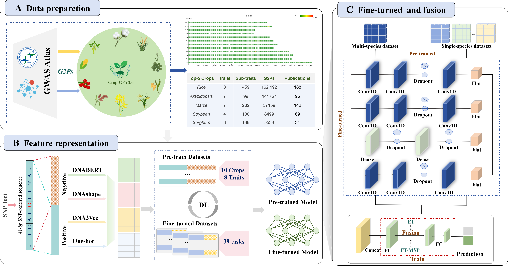

# Crop-GPA 2.0：a pre-trained framework for crop genotype-phenotype associations prediction

## Introduction

Crop-GPA 2.0 is a deep-learning-based cross-species prediction framework for trait-associated single nucleotide polymorphisms (TA-SNPs). By integrating genotype-phenotype association (GPA) data from genome-wide association studies (GWAS), it adopts a transfer learning strategy of "pre-training-fine-tuning-model fusion" to achieve high-precision prediction of agronomy-related SNPs. The framework is applied to traits with limited training data such as Trait A and Trait B, successfully covering genome-wide TA-SNP prediction for 10 major crops and 8 key agronomic traits.

## Frameworks



## Dataset
The full dataset is not provided in the code. If you wish to use it, please download and process it from https://ngdc.cncb.ac.cn/gwas/ on your own, then place it in the "Data" directory.

## System Requirements
The source code was developed in Python 3.8 using TensorFlow 2.6.0. The required Python dependencies are listed below. Crop-GPA 2.0 is supported on any standard computer and operating system (Windows/macOS/Linux) with enough RAM to run. There are no additional non-standard hardware requirements.

```markdown
tensorflow==2.6.0
keras==2.6.0
scikit-learn==1.3.2
numpy==1.19.5
matplotlib==3.3.4
pandas==1.3.3
```
## Usage

### 1.Generate data for the experiment
#### Description
Before training or evaluating any model, you must extract meaningful features from your raw DNA sequences. This project supports four types of feature extraction methods, each capturing different biological or contextual information of DNA.

#### Step-by-step Guide 

When the dataset is ready, run the following scripts to extract different features:
```markdown
cd Feature
python Onehot.py DNA2vec.py DNABERT.py DNAshape.py
```
The Feature directory contains the following scripts:
* Feature/Onehot.py: Encodes DNA sequences as binary vectors, where each nucleotide (A, T, C, G) is represented by a unique binary code.
* Feature/DNA2vec.py: Converts DNA k-mers into dense vectors using pre-trained DNA2vec embeddings, capturing contextual relationships.
* Feature/DNABERT.py: Applies a pre-trained DNABERT model to extract contextual embeddings from DNA sequences, similar to NLP models.
* Feature/DNAshape.py: Predicts DNA shape features (e.g., HelT, MGW, ProT, Roll) using DNAshape or similar tools.

### 2.Training
The training process in this project consists of three stages: cross-species and single-species pre-training → fine-tuning both models → model fusion, aiming to leverage both broad and specific biological signals.

```markdown
cd Model
python Pre-training.py
python Fine-tune.py
python Fusion.py
```
The Model directory contains the following scripts:
* Model/Pre-training.py: Perform joint pre-training on multiple species to obtain a cross-species model, and separately pre-train on a single species to get a single-species model.
* Model/Fine-tune.py: Fine-tune both pretrained models on a specific trait of the target species to obtain two fine-tuned models.
* Model/Fusion.py: Fuse the two fine-tuned models to obtain the final prediction model.

## Citation
If you use Crop-GPA 2.0, please cite our paper: Yujia Gao, Meng Wang, Mengjie Cai, Le Gao, Quan Lu and Zhenyu Yue*. Crop-GPA 2.0：a pre-trained framework for crop genotype-phenotype associations prediction, 2025, Submitted.
